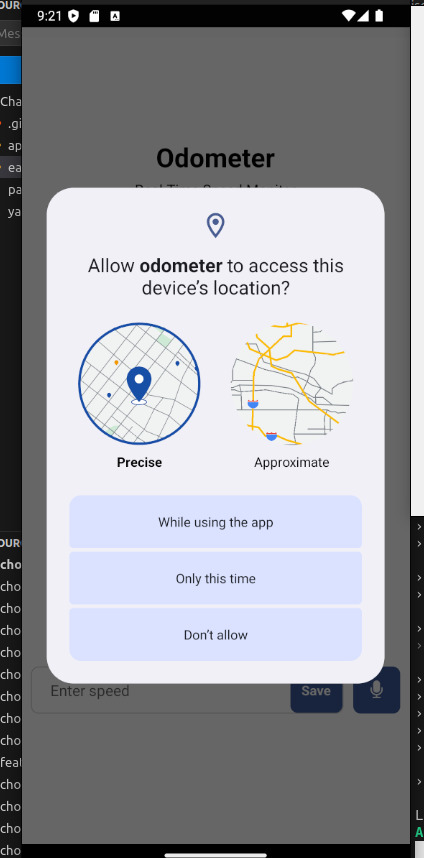

### Odometer

#### Measures max & current speed of a moving car, tracking GPS and warns of exceeding speed limit set

<table>
<tr>
<th> Odometer Screens</th>
</tr>
<tr>
<td>

</td>
</tr>
</table>

### build commands using eas

#### for android
##### preview
###### eas build --profile preview --platform android

##### dev
###### eas build --profile development --platform android

#### for ios
###### eas build --profile development --platform ios